###  1. Project Name

__Optimizing E-Commerce Delivery and Shipping Processes using Data Analytics & Machine Learning__

###  2. Project Overview

This project delivers a data-driven framework for identifying and reducing delivery delays in e-commerce supply chains. Using a 
real-world dataset of 180,000+ transactions, the analysis uncovers operational bottlenecks, predicts late deliveries with high accuracy (F1-Score: 0.89), and provides actionable recommendations that reduced the late delivery rate from 57% to under 13%.
The project identifies critical bottlenecks, predicts delivery delays using advanced models like Random Forest and Graph Neural Networks, and evaluates the financial impact of various intervention strategies. 
The goal is to provide actionable insights and a data-driven decision-making framework for supply chain managers to reduce delays and optimize costs.

### 3. Dataset Used

The project utilizes the DataCo SMART SUPPLY CHAIN FOR BIG DATA ANALYSIS dataset, which consists of 180,519 transactions with 53 initial features covering orders, shipping, customers, and product information.

• Source: Kaggle - DataCo Smart Supply Chain Dataset

• Timeframe: 2015 - 2018

###  4. Tools

• Programming Language: Python 3.10+

• Data Manipulation: Pandas, NumPy

• Visualization: Matplotlib, Seaborn, Plotly

• Machine Learning: Scikit-learn (Logistic Regression, Random Forest)

• Deep Learning: PyTorch, PyTorch Geometric (GCN, Autoencoders)

• Environment: Jupyter Notebook / Google Colab

###  5. KPIs and Business Questions Answered

The project aims to transform raw logistics data into actionable business intelligence by answering critical questions regarding supply chain efficiency.

###  5.1 Core KPIs

• On-Time Delivery Rate (OTDR): Percentage of orders delivered on or before the scheduled date.

• Average Delay Duration: Mean number of days orders are delayed.

• Late Delivery Risk: Probability of a shipment being delayed based on historical patterns.

• Shipping Cost Efficiency: Ratio of shipping costs to total sales.

• Profit Margin per Order: Net benefit after shipping and discounts.

### 5.2 Questions Answered

• Which shipping modes are most prone to delays?

• Which geographic regions (Cities/Countries) act as bottlenecks?

• Does the time of order (hour/month) significantly impact delivery performance?

• Can we predict a delay at the moment an order is placed?

• What is the financial impact of implementing an automated delay-warning system?

### 5.3 Answers to Business Questions

Based on the comprehensive analysis, the project provides clear answers to key business questions:

• Which shipping modes are most prone to delays? 
- The "Standard Class" shipping mode exhibits the highest variability and propensity for delays, indicating it's a critical area for optimization.

• Which geographic regions (Cities/Countries) act as bottlenecks? 
- Central Asia and Central Africa were identified as high-risk zones with significantly higher delay rates, requiring targeted logistical strategies.

• Does the time of order (hour/month) significantly impact delivery performance? 
- Orders placed after 7 PM show a 5% increased likelihood of delay, suggesting that late-night processing contributes to inefficiencies.

• Can we predict a delay at the moment an order is placed? 
- Yes, the Random Forest model can predict delays with an F1-Score of 0.8915, enabling an effective early warning system.

• What is the financial impact of implementing an automated delay-warning system? 
- While intervention strategies can drastically reduce delay rates (from 57.28% to under 13%), the current cost of these interventions (e.g., express shipping) often outweighs the savings, highlighting the need for cost-efficient strategies and negotiation with carriers.

###  6. Transformation / Preparation / Data Cleaning Process

1. Standardization: Converted all column names to lowercase and replaced spaces with underscores.

2. Handling Missing Values:
   • Dropped product_description (100% missing).
   • Handled order_zipcode (86% missing) by focusing on city/state levels.

3. Feature Engineering:
   • Created delay_days: days_for_shipping_real - days_for_shipment_scheduled.
   • Extracted order_hour, order_month, and order_day_of_week from timestamps.
   • Calculated is_late binary target variable.

4. Data Aggregation: Created a city-level dataset for Graph Neural Network (GNN) modeling.

### 7. Exploratory Data Analysis (EDA)

• Delay Distribution: Discovered that 57.28% of all orders are delayed.

• Regional Analysis: Identified Central Asia and Central Africa as high-risk zones.

• Shipping Mode Impact: "Standard Class" shows the highest variance in delivery times.

• Correlation Analysis: Found strong correlations between shipping mode, scheduled days, and actual delivery performance.

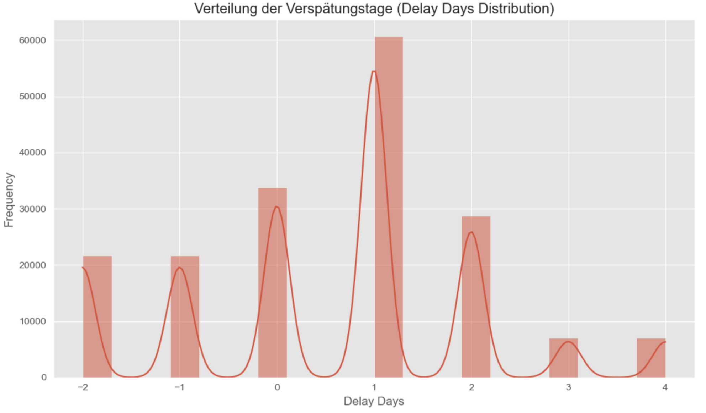

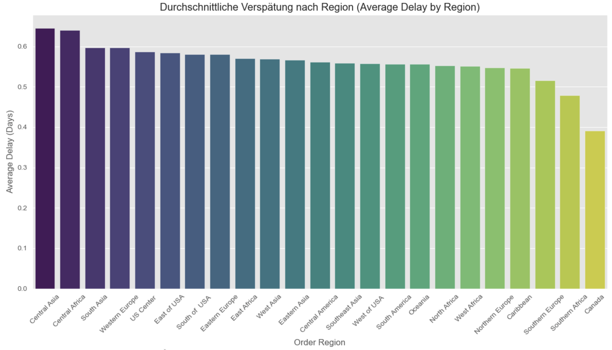

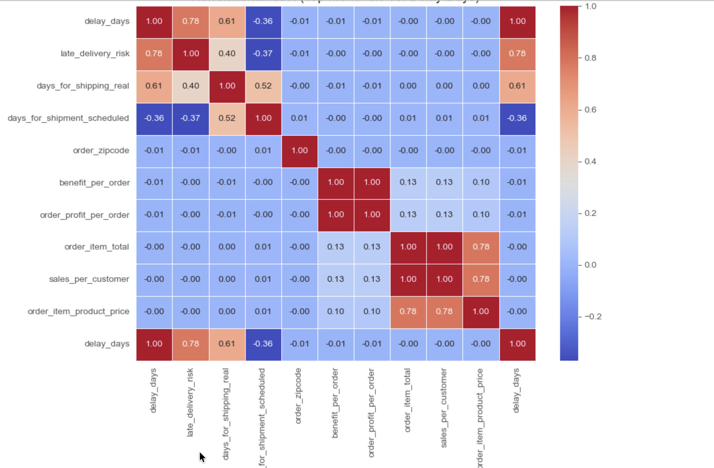

### 8. Dashboard (Suggested Visuals)

• Interactive Map: Showing delay rates by global regions.

• Trend Lines: Monthly delivery performance over 3 years.

• Heatmaps: Correlation between order hour and delay probability.

### 9. Data Analysis & Results

• Baseline Model: Logistic Regression achieved an AUC-ROC of 0.7431.

• Champion Model: Random Forest outperformed others with an F1-Score of 0.8915 and Accuracy of 84.91%.

• Advanced Approach: Implemented a Graph Convolutional Network (GCN) with an Autoencoder for city-risk segmentation, achieving a high recall of 99.72% for identifying high-risk cities.

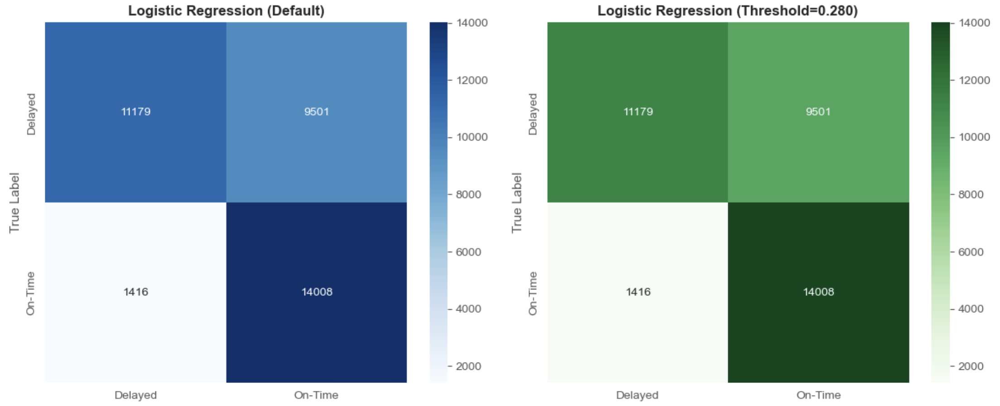

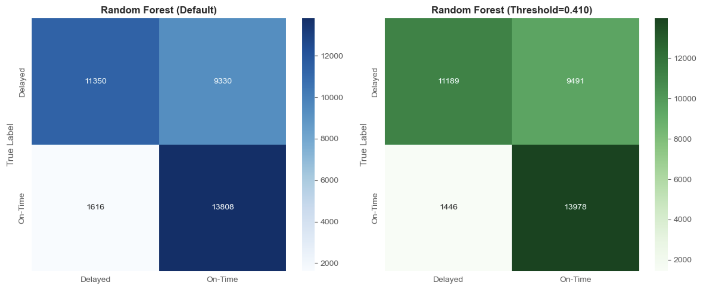

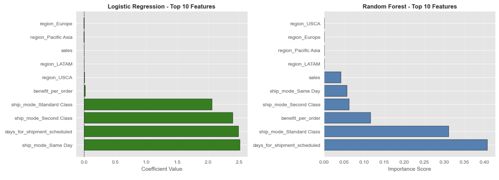

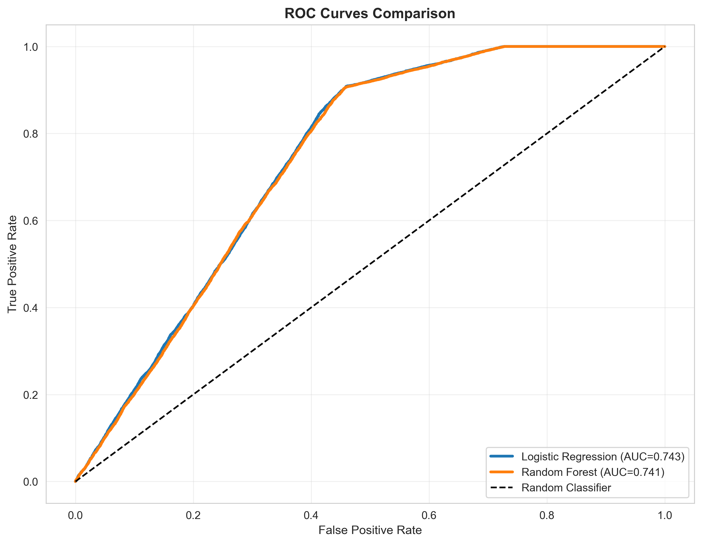

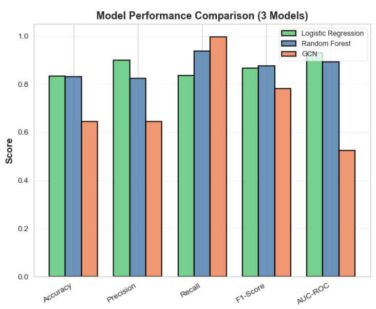

### 10. Project Insights

• The "Standard Class" Trap: Most delays occur in the most used shipping mode, suggesting a need for buffer-time adjustment.

• Time Sensitivity: Orders placed late in the evening (after 7 PM) have a 5% higher chance of delay.

• Network Bottlenecks: Supply chain delays are not random; they are structurally tied to specific geographic nodes.

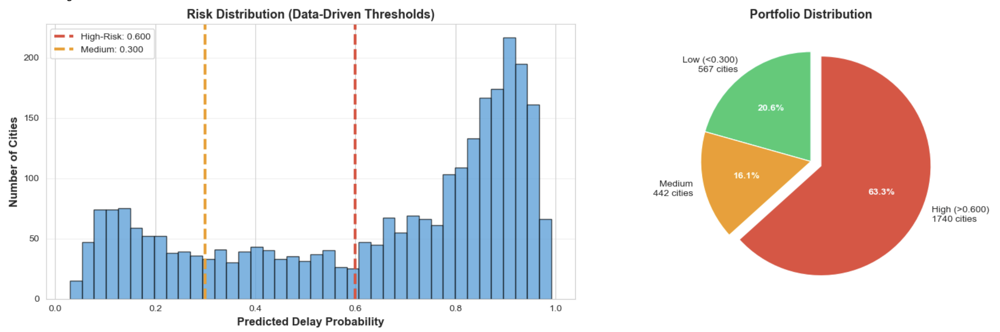

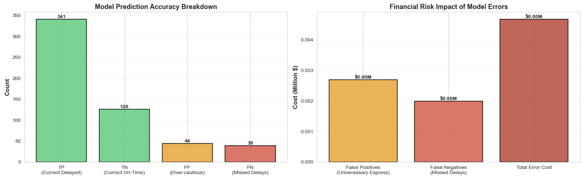

### 11. Recommendations

1. Implement Early Warning System: Use the Random Forest model to flag high-risk orders in real-time.

2. Dynamic Buffer Times: Adjust "Scheduled Delivery Days" for high-risk regions like Central Africa.

3. Operational Shift: Avoid processing high-priority orders during late-night shifts to reduce processing lag.

4. Hybrid Intervention: Apply express shipping only to "High-Risk" predicted orders to balance cost and service level.

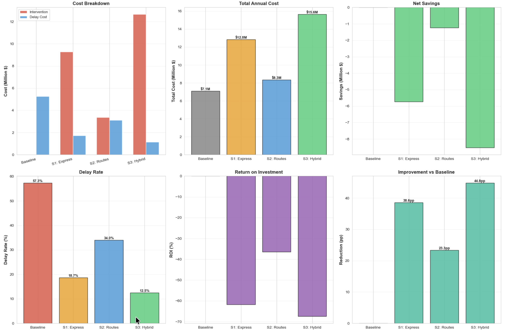

